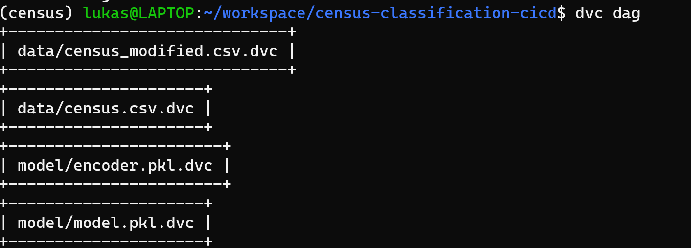
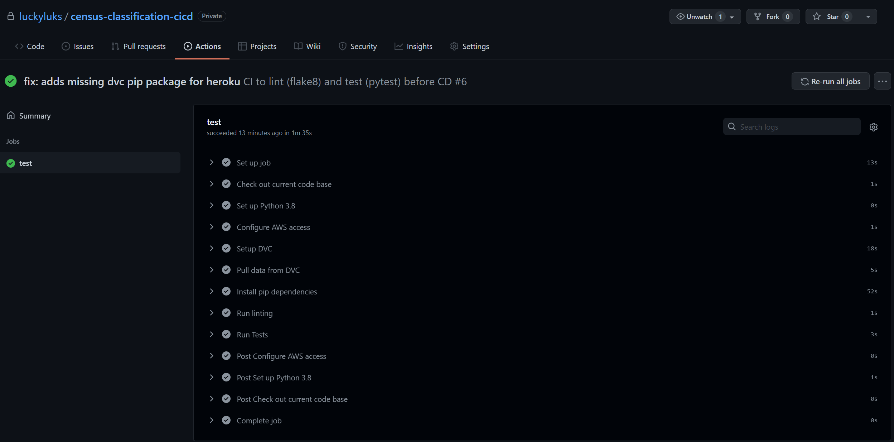
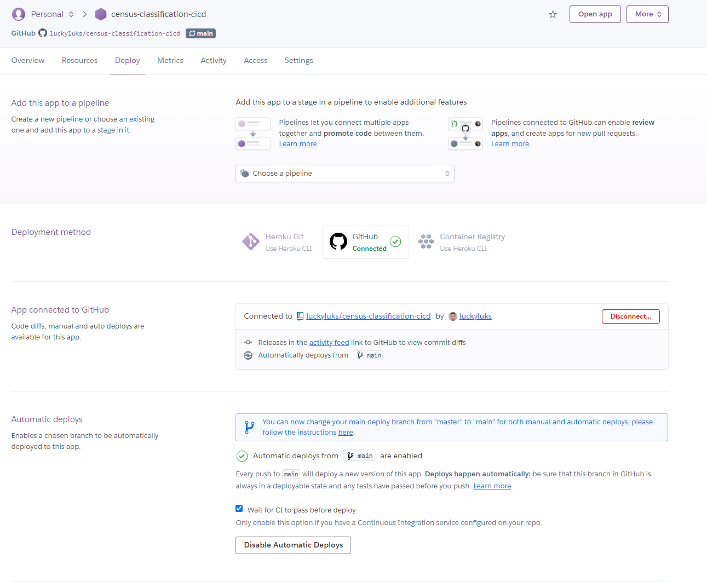
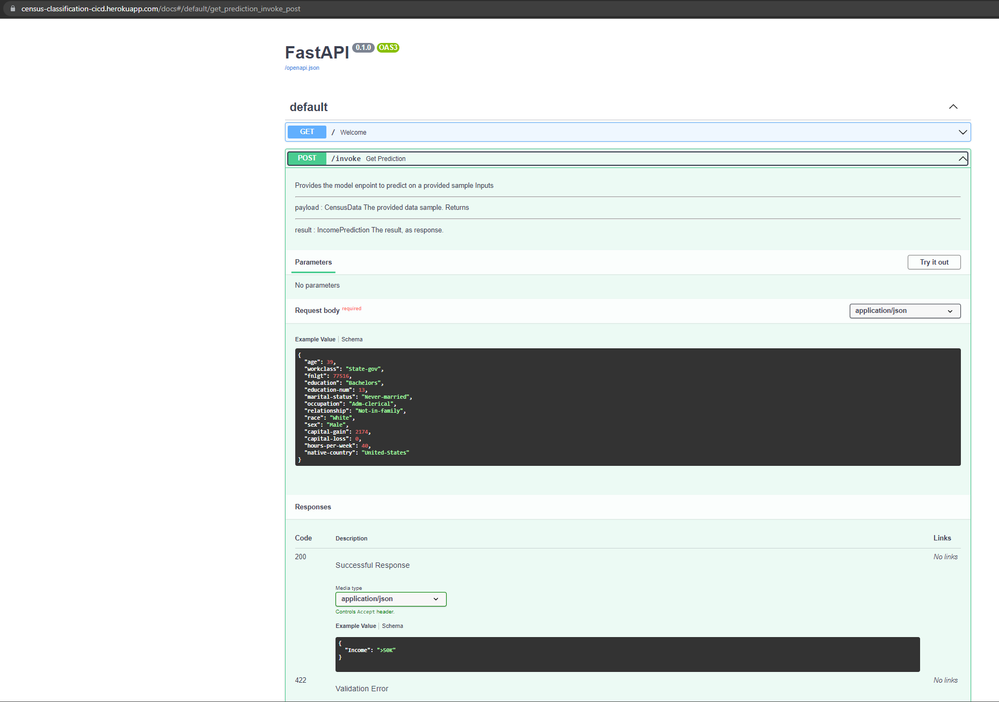
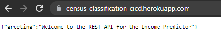
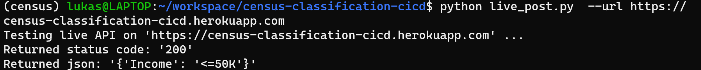

# Deploy an ML application serving an ML model with FastAPI on Heroku

## Project Details

**Material and links:**
 * [Original instructions](doc/instructions.md)

### Description:
In this project, as part of the [Udacity ML Devops Nanodegree](https://www.udacity.com/course/machine-learning-dev-ops-engineer-nanodegree--nd0821), the goal was to develop and deploy a simple ML application to serve a simple ML model with a REST API by FastAPI and served as a dyno on Heroku.

### Focus:
In this project, the overall project focus was to develop the wrapping around the ML model, including the API and CI/CD pipeline. The model and its performance was not important.

### Stack:
The following tools create the stack for the pipeline:
- [[Github](https://github.com/)] as code base repository, including the versioning of code **and** used for continous integration (CI) testing via Github Actions
- [[Data Version Control (DVC)](https://dvc.org/)] a framework to track ML artifacts (data, models) on remote storage (S3, GDrive, etc.)
- [[Heroku](https://heroku.com/)] as platform as a service (PaaS), to enable continous deployment (CD) for this repo
- [[Scikit-learn](https://scikit-learn.org/)] a modeling framework for machine learning models
- [[pytest](https://docs.pytest.org/)] a python test module, to do python tests
- [[flake8](https://flake8.pycqa.org/)] a python test module, to ensure clean code

### Code Base:
in the following a simplified version of the code base structure is described:

```markdown
.
├── README.md: this readme
├── .dvc: includes the configuration for the DVC remote storage
├── .github: includes the CI defition for Github Actions
├── Procfile: a file that specifies the CD deployment on heroku
├── data: contains the DVC tracked data files
├── doc: contains instructions and screenshots
├── live_post.py: a test file, to test a running deployment on heroku
├── main.py: the main file for the REST API
├── model: contains model files (model, encoder, binarizer) and test performances
├── model_card_template.md: a model description according to the 'Model Card Paper' (https://arxiv.org/pdf/1810.03993.pdf)
├── notebooks: contains JupyterLab notebooks used during development
├── predictor: contains the code for model training
│   └── ml
│       ├── data.py: data methods used
│       ├── model.py: the model specification and methods
│       └── train_model.py: the main training file
├── requirements.txt: specifies application requirements for pip
└── tests: contains test for API and training methods
```

---
## Running the project

### Setup

This project is not intended to run locally, since it was developed to run in CD. However, if you want to run it locally, follow these steps:

1. You need pip installed, preferably in Linux, or in WSL on Windows
2. Install the project requirements:  

    ```console
    > pip install -r requirements.txt
    ```

### Running

You can now run local test and formatting checks with ``pytest`` and ``flake8``
```console
> pytest -vv
> flake8 .
```

To initiate a training, pull the data from DVC (login required, ask me for access) and run the provided FastAPI app locally:
```console
> dvc pull
> uvicorn main:app --reload
```
This serves the endpoints "/" and "/invoke" on [http://localhost:8000](http://localhost:8000).  
Check out the docs on [http://localhost:8000/docs](http://localhost:8000/docs).


## Documentation

The following images are required to fulfill the project requirements:


1. **DVC**: 4 files (data, data cleaned, model and encoder) are tracked with DVC

    

2. **CI**: A Github action specification was added to the repo and run successfully

    

3. **CD**: A Heroku app was created and connected to the github repo, including successful CI runs. The app is available [here](https://census-classification-cicd.herokuapp.com/)

    

4. **FastAPI**: The created and served fastAPI app has an integrated API documentation under `/docs` where an example can be found, via python type hints and pydantic model classes

    

5. **LIVE (GET)**: The created fastAPI app is served successfully and displays the welcome greeting on the root endpoint

    

6. **LIVE (POST)**: The created fastAPI app is served successfully, the defined enpoint `/invoke` invokes a call to the served ML model, in order to pass provided JSON data as input and returns the prediction with a status code of ``200``

    


---
## Conclusion

### Summary
The ML application including training and serving a ML model was developed. Once trained, the repo is tested with CI of Github actions and runs with CD on heroku.
The app is available [here](https://census-classification-cicd.herokuapp.com/)

### Opportunities for future improvement

As the focus on this project was to develop the CI/CD around a ML model for the given problem, the explorative part could be improved as the following, to improve the overall performance of the models on the problem:
- Do an EDA, with graphs, deeper insight in distributions, construct features
- Test out other models or even other ML/DL frameworks